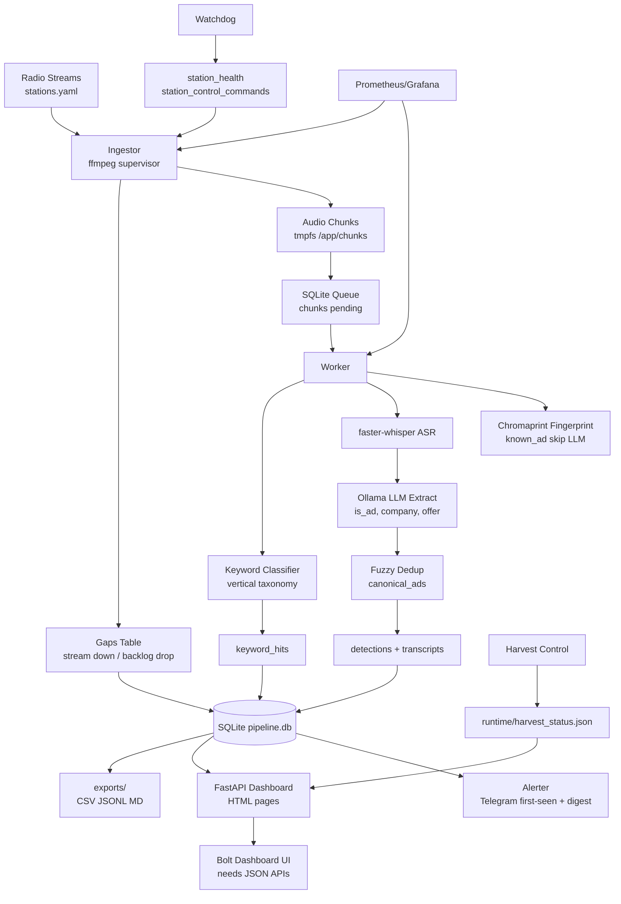

# Radio Ad Pipeline — Project Structure for Bolt Dashboard

> Generated: 2026-06-21 · Inspected from live repo + Docker stack (`radio-worker` DB snapshot)

---

## 1. Executive Summary

The **Radio Ad-Sensing Pipeline** is a local, Docker-based system that ingests 4–10 U.S. News/Talk radio streams 24/7, segments audio into fixed-length chunks via ffmpeg, and processes them through a GPU worker (faster-whisper ASR + Ollama/Qwen LLM extraction). Detected ads are fuzzy-deduped against canonical ads, stored in SQLite, and alerted via outbound Telegram.

Beyond core ad detection, the project has expanded into **vertical keyword monitoring** (loan/financial terms), **advertiser entity tracking**, **trademark/CFPB candidate research**, **novelty-based keyword discovery**, and **operator harvest controls** for overnight keyword collection runs.

A **FastAPI + Jinja2/HTMX dashboard** already exists (`python -m dashboard`, Docker port **8081**). It is read-only over SQLite and serves HTML pages for ads, stations, keyword hits, verticals, novelty review, CFPB data, watchdog ops, and radio harvest control. **Most routes return HTML, not JSON** — only `/health` and `/api/harvest/*` expose JSON today.

Live production DB (`data/pipeline.db`, 32 tables): **60,207 chunks**, **4,173 detections**, **1,467 canonical ads**, **10 enabled stations**, queue **80 pending / 11 processing / 18,715 done / 41,402 dropped**.

Monitoring stack: Prometheus (`:9090`), Grafana (`:3000`), per-service metrics on ports 9101–9105.

---

## 2. Current Folder Structure

| Folder | Purpose |
|---|---|
| `config/` | Runtime YAML: `stations.yaml` (stream URLs, enabled flags), `settings.yaml` (chunk length, thresholds), keyword/vertical taxonomies |
| `ingestor/` | ffmpeg supervisor per station; writes WAV chunks + gap logs to SQLite queue |
| `worker/` | Queue consumer: fingerprint → ASR → LLM extract → dedup → keyword hits → persist |
| `alerter/` | Telegram outbound: first-seen ad alerts, ops alerts, periodic pipeline reports |
| `watchdog/` | Station health monitor: stale detection, auto-restart, pool promotion |
| `dashboard/` | FastAPI read-only UI: routes, Jinja2 templates, query layer, harvest API wrapper |
| `shared/` | Import-light core: DB/migrations, models, config loader, metrics, verticals, station control |
| `scripts/` | Operator CLI tools: harvest control, pipeline status, keyword triage, exports, station rotation |
| `monitoring/` | Prometheus scrape config + Grafana dashboards (provisioned) |
| `data/` | Runtime (gitignored): `pipeline.db`, `chunks/`, `ad_archive/`, exports |
| `exports/` | Generated CSV/JSONL/Markdown reports from offline analysis scripts |
| `runtime/` | Ephemeral state files (e.g. `harvest_status.json`) |
| `tests/` | pytest suite (112+ tests) |
| `docs/` | Operator docs, recommended migrations |
| `plan/` | Phase reports and handoffs |

---

## 3. Services / Modules

| Component | Path | Purpose | Notes |
|---|---|---|---|
| Ingestor | `ingestor/` | ffmpeg stream capture, chunk writer, gap logger | Docker: `radio-ingestor`, metrics `:9101` |
| Worker | `worker/` | ASR + LLM extraction + dedup + keyword classifier | Docker: `radio-worker`, GPU, metrics `:9102` |
| Alerter | `alerter/` | Telegram alerts + periodic reports | Docker: `radio-alerter`, metrics `:9103` |
| Dashboard | `dashboard/` | FastAPI operator UI (HTML + limited JSON) | Docker: `radio-dashboard`, **`:8081→8080`** |
| Watchdog | `watchdog/` | Station health, restart commands, pool rotation | Docker: `radio-watchdog`, metrics `:9105` |
| Ollama | (compose service) | Local LLM inference (Qwen2.5) | Internal `:11434` |
| Prometheus | `monitoring/` | Metrics scrape + storage | **`:9090`** |
| Grafana | `monitoring/grafana/` | Operational dashboards (19 panels) | **`:3000`** |
| Shared DB | `shared/db.py`, `shared/migrations/` | SQLite WAL, 21 migrations, `@retry_on_busy` | DB path: `data/pipeline.db` |
| Harvest control | `scripts/harvest_control.py`, `dashboard/harvest_api.py` | Overnight keyword harvest probe/start/stop | Status in `runtime/harvest_status.json` |
| Novelty engine | `worker/novelty_*.py`, `dashboard/novelty_queries.py` | Keyword candidate discovery + review workflow | Tables mostly empty in current DB |
| CFPB collector | `collectors/` (referenced by dashboard) | Complaint ingestion → brand candidates | 7,000 raw complaints, 213 candidates in DB |
| Pipeline ops scripts | `scripts/pipeline_status_query.py`, `scripts/pipeline-loan-ops.ps1` | CLI status queries, loan vertical ops | Used by Hermes/Telegram reports |

---

## 4. Data Flow



**Key flow notes (from code, not guessed):**

1. Queue is the `chunks` table — no Redis. Statuses: `pending` → `processing` → `done` | `dropped`.
2. Worker may skip LLM for fingerprint-matched `known_ad` chunks but still transcribes.
3. Keyword hits are written by the consumer personal-loan/vertical classifier path; current DB has only **1** `keyword_hits` row (exports contain richer offline candidate data).
4. Dashboard opens **read-only** SQLite connections; POST routes (watchdog restart, harvest start/stop, novelty review) enqueue commands or mutate review state.
5. Do **not** read `data/pipeline.db` from Windows host while Docker ingest is running — use `docker exec radio-worker`.

---

## 5. Database Schema

**DB path:** `data/pipeline.db` (Docker: `/app/data/pipeline.db`)  
**Engine:** SQLite WAL · **32 tables** · **13 migrations applied**

### Core pipeline tables

| Table | Purpose | Important Columns | Dashboard Use |
| ----- | ------- | ----------------- | ------------- |
| `stations` | Radio station registry | `name`, `url`, `format`, `enabled`, `display_name` | Station list, stream status, market display |
| `chunks` | Work queue + timing | `station_id`, `path`, `start_ts`, `end_ts`, `status`, `error`, `known_ad_id` | Queue health, processing stats, errors |
| `transcripts` | ASR output | `chunk_id`, `text`, `asr_duration_ms`, `segments_json` | Detection transcript snippets |
| `detections` | Per-chunk LLM extraction | `chunk_id`, `canonical_ad_id`, `is_ad`, `company_name`, `phone_number`, `website`, `offer_summary`, `confidence`, `alerted` | Detections feed, ad detail |
| `canonical_ads` | Deduped ad entities | `company_name`, `phone_norm`, `category`, `first_seen`, `last_seen`, `airing_count`, `archived_audio_path` | Ads list, airing frequency, audio playback |
| `gaps` | Stream interruption log | `station_id`, `start_ts`, `end_ts`, `reason` | Gap timeline, ingest health |
| `fingerprints` | Chromaprint vectors | `canonical_ad_id`, `chromaprint_vector` (BLOB), `duration` | Dedup annotation (0 rows currently) |
| `status` | Key-value ops state | `key`, `value`, `updated_at` | Pipeline health key/values |

**Current row counts:** chunks 60,207 · detections 4,173 · canonical_ads 1,467 · gaps 32,176 · transcripts 18,757 · stations 25 (10 enabled)

### Keyword / vertical tables

| Table | Purpose | Important Columns | Dashboard Use |
| ----- | ------- | ----------------- | ------------- |
| `keyword_hits` | Matched taxonomy keywords in transcripts | `station_id`, `keyword`, `chunk_id`, `detection_id`, `hit_ts`, `context_excerpt` | Keyword detections page (**1 row** currently) |
| `advertiser_opportunities` | Vertical-scoped ad opportunities | `vertical`, `company_name`, `domain`, `hit_ts`, `source_keywords`, `confidence`, `approved` | Opportunity review (2 rows) |
| `station_daily` | Daily rollup per station | `date`, `chunks_count`, `gap_count`, `keyword_hits`, `loan_detections` | Scorecard, trends (250 rows) |

### Advertiser / trademark tables

| Table | Purpose | Important Columns | Dashboard Use |
| ----- | ------- | ----------------- | ------------- |
| `advertiser_entities` | Radio-detected advertiser brands | `canonical_name`, `vertical`, `domain`, `status`, `confidence` | Advertisers page (1 entity) |
| `advertiser_entity_detections` | Per-detection advertiser evidence | `hit_ts`, `station_id`, `transcript`, `offer_summary`, `detection_confidence` | Advertiser detail drill-down (4 rows) |
| `trademark_entities` | Trademark risk registry | `canonical_name`, `review_status`, `trademark_risk`, `ad_copy_allowed` | Trademark compliance (74 entities) |
| `trademark_keyword_candidates` | Keyword variants per entity | `keyword`, `status`, `score`, `verification_status`, `trademark_risk` | Keyword candidates page (449 rows) |
| `trademark_aliases` | Entity name aliases | `alias_name`, `normalized_alias` | Entity normalization (75 rows) |

### Novelty / discovery tables

| Table | Purpose | Important Columns | Dashboard Use |
| ----- | ------- | ----------------- | ------------- |
| `raw_discovery_items` | External source ingest | `source_type`, `source_url`, `market`, `state` | Discovery sources (**0 rows**) |
| `candidate_terms` | Extracted candidate phrases | `candidate_text`, `vertical`, `source_confidence` | Candidate pipeline (**0 rows**) |
| `novelty_results` | Novelty scoring output | `novelty_status`, `novelty_score`, `opportunity_score`, `report_eligible` | Novelty review pages (**0 rows**) |
| `keyword_opportunities` | Report-eligible opportunities | `opportunity_text`, `risk_level`, `status`, scores | Opportunities inbox (**0 rows**) |
| `known_terms_pending` | Terms awaiting promotion to known set | `term`, `term_type`, `vertical`, `status` | Known-pending review (**0 rows**) |

### CFPB tables

| Table | Purpose | Important Columns | Dashboard Use |
| ----- | ------- | ----------------- | ------------- |
| `cfpb_complaints_raw` | Raw complaint records | `company`, `product`, `state`, narrative fields | CFPB research (7,000 rows) |
| `cfpb_company_entities` | Aggregated companies | `company_canonical`, `complaint_count`, `review_status` | Entity list (209 rows) |
| `cfpb_brand_candidates` | Brand keyword candidates | `candidate_name`, `score`, `verification_status` | Candidate review (213 rows) |
| `cfpb_collection_runs` | Ingestion run log | `status`, `records_inserted`, `error_message` | Run history (3 rows) |

### Ops / watchdog tables

| Table | Purpose | Important Columns | Dashboard Use |
| ----- | ------- | ----------------- | ------------- |
| `station_health` | Per-station health state | `health_state`, `last_chunk_at`, `last_error`, `consecutive_failures` | Watchdog ops (25 rows) |
| `station_recovery_events` | Recovery audit log | `event_type`, `old_state`, `new_state`, `action_taken` | Incident timeline (248 rows) |
| `station_pool` | Backup station pool | `priority`, `market`, `vertical`, `stream_validation_status` | Rotation planning (25 rows) |
| `station_control_commands` | Pending restart/disable cmds | `station_id`, `command`, `status`, `reason` | Manual restart queue (91 rows) |

---

## 6. Existing API Routes

### JSON endpoints (Bolt-ready today)

| Method | Route | File | Purpose | Data Source |
| ------ | ----- | ---- | ------- | ----------- |
| GET | `/health` | `dashboard/main.py` | DB reachability + pending chunk count | `queries.fetch_health()` → SQLite |
| GET | `/api/harvest/status` | `dashboard/routes/harvest.py` | Harvest session state, profile, timestamps | `runtime/harvest_status.json` + DB snapshot |
| GET | `/api/harvest/detections` | `dashboard/routes/harvest.py` | Recent harvest detections (`?limit=50`) | SQLite via `harvest_api.fetch_harvest_detections()` |
| GET | `/api/harvest/queue-health` | `dashboard/routes/harvest.py` | done/pending/dropped counts + drop ratio | SQLite `chunks` |
| GET | `/api/harvest/stations` | `dashboard/routes/harvest.py` | Station config from YAML | `config/stations.yaml` via `load_stations()` |
| POST | `/api/harvest/probe` | `dashboard/routes/harvest.py` | Probe up to 20 station streams | Spawns `scripts/harvest_control.py probe` |
| POST | `/api/harvest/start` | `dashboard/routes/harvest.py` | Start overnight harvest profile | Spawns `scripts/harvest_control.py start` |
| POST | `/api/harvest/stop` | `dashboard/routes/harvest.py` | Stop harvest session | Spawns `scripts/harvest_control.py stop` |

### HTML pages (existing dashboard — no JSON equivalent)

| Method | Route | File | Purpose | Data Source |
| ------ | ----- | ---- | ------- | ----------- |
| GET | `/` | `dashboard/main.py` | Overview stats + station health + vertical summaries | SQLite |
| GET | `/ads` | `dashboard/main.py` | Paginated canonical ads list (HTMX partial support) | `canonical_ads` |
| GET | `/ads/{ad_id}` | `dashboard/main.py` | Ad detail + detections + audio | `canonical_ads`, `detections` |
| GET | `/audio/{resource_id}` | `dashboard/main.py` | Stream archived ad audio file | `data/ad_archive/` |
| GET | `/stations` | `dashboard/main.py` | Station list with live/stale/down status | `stations`, `chunks` |
| GET | `/gaps` | `dashboard/main.py` | Gap timeline | `gaps` |
| GET | `/scorecard` | `dashboard/main.py` | 7-day station scorecard + recommendations | `station_daily`, `chunks` |
| GET | `/keywords/hits` | `dashboard/main.py` | Keyword hits by window (`?days=7`) | `keyword_hits` |
| GET | `/keywords` | `dashboard/main.py` | Station × keyword matrix | `keyword_hits` |
| GET | `/keywords/trademark` | `dashboard/main.py` | Trademark keyword candidates | `trademark_keyword_candidates` |
| GET | `/verticals` | `dashboard/main.py` | Vertical summaries + queue health | vertical config + DB |
| GET | `/verticals/{slug}` | `dashboard/main.py` | Vertical detail: hits + opportunities | SQLite + YAML |
| GET | `/review` | `dashboard/main.py` | Review inbox (tier A/B/C filter) | detections + keyword_hits |
| GET | `/advertisers/opportunities` | `dashboard/main.py` | Hit advertiser entities | `advertiser_entities` |
| GET | `/advertisers/opportunities/{id}` | `dashboard/main.py` | Advertiser detection history | `advertiser_entity_detections` |
| GET | `/cfpb` | `dashboard/main.py` | CFPB overview counts | CFPB tables |
| GET | `/cfpb/candidates` | `dashboard/main.py` | Brand candidates (`?min_score=`) | `cfpb_brand_candidates` |
| GET | `/cfpb/candidates/{id}` | `dashboard/main.py` | Candidate detail | CFPB tables |
| GET | `/cfpb/entities` | `dashboard/main.py` | Company entities | `cfpb_company_entities` |
| GET | `/cfpb/runs` | `dashboard/main.py` | Collection run history | `cfpb_collection_runs` |
| GET | `/ops/watchdog` | `dashboard/main.py` | Watchdog overview | `station_health`, recovery events |
| POST | `/ops/watchdog/restart/{station_id}` | `dashboard/main.py` | Enqueue station restart | `station_control_commands` |
| GET | `/novelty` | `dashboard/routes/novelty.py` | Novelty overview + recent results | novelty tables |
| GET | `/novelty/new`, `/known`, `/noise` | `dashboard/routes/novelty.py` | Filtered novelty results | `novelty_results` |
| GET | `/novelty/known-pending` | `dashboard/routes/novelty.py` | Terms pending promotion | `known_terms_pending` |
| GET | `/sources/landing-pages` | `dashboard/routes/novelty.py` | Landing page source view | discovery tables |
| GET | `/opportunities` | `dashboard/routes/novelty.py` | Report-eligible keyword opportunities | `keyword_opportunities` |
| GET | `/opportunities/batch-review` | `dashboard/routes/novelty.py` | Batch review UI | novelty tables |
| GET | `/opportunities/digest-preview` | `dashboard/routes/novelty.py` | Telegram digest preview | alerter novelty reporter |
| POST | `/novelty/{id}/mark-noise`, `/add-to-known` | `dashboard/routes/novelty.py` | Review actions | novelty review module |
| POST | `/opportunities/{id}/approve\|reject\|archive` | `dashboard/routes/novelty.py` | Opportunity review actions | novelty review module |
| GET | `/radio-harvest` | `dashboard/routes/harvest.py` | Harvest control panel (HTML) | status file + DB |
| GET | `/radio-harvest/status\|detections\|queue\|stations` | `dashboard/routes/harvest.py` | Harvest sub-pages (HTML) | mixed |
| POST | `/radio-harvest/probe\|start\|stop` | `dashboard/routes/harvest.py` | Harvest actions (redirect) | subprocess CLI |

**External metrics (not FastAPI):** ingestor `:9101`, worker `:9102`, alerter `:9103`, dashboard `:9104`, watchdog `:9105`, Prometheus `:9090`, Grafana `:3000`.

---

## 7. Existing Dashboard

**Dashboard exists** — not starting from scratch.

| Property | Value |
|---|---|
| URL (Docker) | `http://127.0.0.1:8081` |
| Internal port | `8080` (`config/settings.yaml`: `dashboard_host: 127.0.0.1`, `dashboard_port: 8080`) |
| Framework | FastAPI + Jinja2 templates + HTMX 2.0 (CDN) |
| Entry point | `python -m dashboard` → `dashboard/__main__.py` → uvicorn |
| Styling | Dark theme inline CSS in `dashboard/templates/base.html` — operational, dense, scannable |
| DB access | Read-only SQLite via `dashboard/queries.py`; `@retry_on_busy` not needed for reads |

### Pages / navigation (from `base.html`)

Overview · Review · Ads · Stations · Watchdog · Scorecard · Verticals · Novelty · Known pending · Landing pages · Opportunities · Hit advertisers · Trademark keywords · Keyword hits · Keyword matrix · CFPB · Gaps · Radio Harvest · Health (JSON)

### Templates structure

```
dashboard/templates/
├── base.html, index.html, ads.html, ad_detail.html, stations.html, gaps.html
├── scorecard.html, review.html, keywords.html, keyword_hits.html
├── verticals.html, vertical_detail.html, no_database.html
├── advertisers/   opportunities.html, detail.html
├── cfpb/          index.html, candidates.html, candidate_detail.html, entities.html, runs.html
├── harvest/       index.html, status.html, detections.html, queue.html, stations.html
├── novelty/       index.html, new.html, known.html, noise.html, opportunities.html, ...
├── ops/           watchdog.html
└── partials/      ads_rows.html (HTMX pagination)
```

### What works

- Full HTML operator UI for ads, stations, gaps, verticals, CFPB, trademark keywords, watchdog restart
- Harvest control panel with JSON API backing
- Audio playback for archived ads (`/audio/{id}`)
- Queue health warnings (drop ratio threshold)
- Docker healthcheck passing (`radio-dashboard` Up 27h healthy)

### What is missing (for Bolt / modern SPA)

- **No JSON REST API** for core entities (ads, detections, stations, keyword hits, advertisers) — HTML-only
- **No CORS / API versioning** for external frontend
- **No WebSocket / SSE** for live queue or station updates
- **No static export download endpoints** — exports live as files in `exports/` only
- **No unified detections API** combining LLM detections + keyword hits + advertiser entities
- Novelty/discovery tables **empty in current DB** — pages exist but show no data
- Only **1 keyword_hit** in live DB — keyword dashboards need harvest run or API expansion

---

## 8. Export / Report Files

All under `exports/` (repo root, not served by dashboard).

| File | Format | Size/Rows | Purpose | Dashboard Use |
| ---- | ------ | --------- | ------- | ------------- |
| `radio_keyword_entity_master.csv` | CSV | 835 rows / 268 KB | Master keyword ↔ entity mapping | Advertisers/keywords cross-ref |
| `keyword_candidates_fresh.csv` | CSV | 835 rows / 202 KB | Fresh keyword candidates from harvest | Keyword Candidates page |
| `keyword_candidates_fresh_top100.jsonl` | JSONL | 100 rows / 72 KB | Top-100 fresh candidates | Priority review queue |
| `keyword_candidates_current.csv` | CSV | 450 rows / 93 KB | Current candidate snapshot | Comparison baseline |
| `keyword_candidates_current.jsonl` | JSONL | 449 rows / 237 KB | Current candidates structured | API seed / import |
| `overnight_keyword_candidates.csv` | CSV | 459 rows / 82 KB | Overnight harvest output | Harvest results display |
| `overnight_keyword_candidates.jsonl` | JSONL | 458 rows / 193 KB | Overnight harvest structured | Same |
| `keyword_triage_report.md` | Markdown | 518 lines / 90 KB | Triage analysis + recommendations | Reports page |
| `radio_financial_opportunities_report.md` | Markdown | 201 lines / 27 KB | Financial vertical opportunities | Reports page |
| `radio_financial_p0_p1_scoring.csv` | CSV | 169 rows / 35 KB | P0/P1 opportunity scoring | Prioritization table |
| `radio_financial_ads_research_queue.csv` | CSV | 109 rows / 45 KB | Research queue | Review workflow |
| `radio_unknown_financial_review_queue.csv` | CSV | 46 rows / 10 KB | Unknown financial hits for review | Review queue |
| `loan_station_classification_audit.csv` | CSV | 86 rows / 19 KB | Station classifier audit | Stations quality |
| `loan_station_classification_audit.md` | Markdown | 138 lines | Audit narrative | Reports page |
| `final_48h_loan_station_batch.csv` | CSV | 16 rows | 48h batch station plan | Batch ops |
| `next_48h_loan_station_batch.csv` | CSV | 13 rows | Next batch plan | Batch ops |
| `p0_keyword_sets.csv` | CSV | 115 rows | P0 keyword set definitions | Keyword config reference |
| `station_rotation_commands.md` | Markdown | 54 lines | Rotation command cheat sheet | Ops reference |
| `station_stream_retest_results.md` | Markdown | 26 lines | Stream validation results | Station health |
| `fresh_keyword_findings.md` | Markdown | 56 lines | Latest keyword findings summary | Overview widget |
| `radio_classification_validation.md` | Markdown | 93 lines | Classifier validation report | Pipeline health |
| `loan_classifier_fix_validation.md` | Markdown | 45 lines | Classifier fix verification | Pipeline health |

**Note:** These files are generated offline by scripts in `scripts/`. No HTTP endpoint serves them today.

---

## 9. Available Dashboard Data

### Ready now (SQLite + existing queries)

| Data domain | Source | Live count | Access today |
|---|---|---|---|
| Station status | `stations` + latest `chunks.end_ts` | 25 stations, 10 enabled | HTML `/stations`, `/` overview |
| Stream health | Derived stale/down from chunk age | Computed live | HTML `/stations`, `/scorecard` |
| Queue status | `chunks.status` | 80 pending, 11 processing, 18,715 done, 41,402 dropped | HTML `/verticals`, harvest JSON API |
| Ad detections | `detections` + `canonical_ads` | 4,173 detections, 1,467 ads | HTML `/ads`, `/review` |
| Transcripts | `transcripts` | 18,757 | Via ad/detection detail pages |
| Gap events | `gaps` | 32,176 | HTML `/gaps` |
| Daily scorecard | `station_daily` | 250 rows | HTML `/scorecard` |
| Watchdog health | `station_health` + recovery events | 25 health rows, 248 events | HTML `/ops/watchdog` |
| Trademark keywords | `trademark_keyword_candidates` | 449 | HTML `/keywords/trademark` |
| CFPB candidates | `cfpb_brand_candidates` | 213 (70+ score: queryable) | HTML `/cfpb/*` |
| Hit advertisers | `advertiser_entities` + detections | 1 entity, 4 detections | HTML `/advertisers/opportunities` |
| Harvest status | `runtime/harvest_status.json` + DB | JSON API `/api/harvest/status` | JSON + HTML `/radio-harvest` |

### Sparse / empty in live DB (pages exist, data missing)

| Data domain | Source | Live count | Notes |
|---|---|---|---|
| Keyword hits (live pipeline) | `keyword_hits` | **1** | Richer data in `exports/keyword_candidates_*.csv` |
| Novelty candidates | `novelty_results`, `candidate_terms` | **0** | Discovery pipeline not populated |
| Keyword opportunities | `keyword_opportunities` | **0** | Review workflow idle |
| Fingerprints | `fingerprints` | **0** | Dedup fingerprinting not populated |

### External / file-only data

| Data domain | Source | Notes |
|---|---|---|
| Keyword candidates (offline) | `exports/keyword_candidates_*.csv/jsonl` | 450–835 rows; needs file read or new API |
| Pipeline reports | `exports/*.md` | Markdown summaries; not HTTP-accessible |
| Prometheus metrics | `:9090` | Queue depth, ASR latency, GPU — needs PromQL integration |
| Grafana dashboards | `:3000` | 19 panels; embed or link |
| Telegram reports | alerter periodic (every 3h) | Outbound only; not queryable |
| Service logs | `docker logs radio-*` | Not exposed via API |

---

## 10. Recommended Dashboard Pages

### Overview

Show:

- Total stations (25 configured, 10 enabled, 10 active ingest targets)
- Active streams (derived: stations with chunk in last N minutes)
- Chunks processed today / total done / dropped / pending
- Detections today (4,173 total)
- Keyword hits total (1 live — show export count as secondary)
- Latest harvest run status (from `/api/harvest/status`)
- Queue drop ratio warning
- Vertical hot/watchlist badges

**Data:** `/api/harvest/status` + new `/api/overview` (see §11) or scrape HTML `/`.

### Stations

Show:

- Station name + display name
- Market/state (from `station_pool.market` or `stations.yaml`)
- Stream URL (from `stations.url` or harvest `/api/harvest/stations`)
- Status: live / stale / down / disabled
- Last chunk timestamp + age
- Detection count + keyword hit count (7d)
- Watchdog state + last error
- Scorecard recommendation (keep/swap/fix)

**Data:** needs `/api/stations` aggregating `stations`, `chunks`, `station_health`, `station_daily`.

### Detections

Show:

- Timestamp (`chunks.start_ts`)
- Station name
- Matched keyword (from `keyword_hits` if linked)
- Transcript snippet (`transcripts.text` or `context_excerpt`)
- Confidence (`detections.confidence`)
- Advertiser/entity (`company_name`, linked `advertiser_entities`)
- is_ad flag, category, offer summary
- Audio clip link if archived

**Data:** needs `/api/detections?station=&since=&limit=` joining detections + chunks + stations + transcripts.

### Keyword Candidates

Show:

- Keyword/name
- Source (`source_type`, export batch id)
- Score / confidence
- Review status (`trademark_keyword_candidates.status` or export `review_status`)
- Risk flags (`trademark_risk`, `ad_copy_allowed`)
- Linked entity

**Data:** DB has 449 trademark candidates; exports add 450–835 harvest candidates. Needs unified `/api/keyword-candidates` or file-import endpoint.

### Advertisers

Show:

- Advertiser name / domain
- Vertical
- Stations detected (from `advertiser_entity_detections`)
- First seen / last seen
- Linked keywords / trademark entity
- Detection count + confidence

**Data:** `/advertisers/opportunities` HTML exists; needs JSON API.

### Reports / Exports

Show:

- CSV/JSONL/Markdown exports from `exports/` with file mtime + row count
- Generated summaries (keyword triage, financial opportunities, batch plans)
- Download links
- Latest overnight harvest summary

**Data:** needs `/api/exports` listing `exports/` directory or static file server.

### Pipeline Health

Show:

- Queue status (pending/processing/done/dropped)
- Drop ratio vs threshold
- Service health (Docker container status)
- Watchdog recovery events (recent)
- Gap count (24h)
- Latest errors (`chunks.error`, `station_health.last_error`)
- Link to Grafana dashboards

**Data:** `/api/harvest/queue-health` + `/health` + new `/api/pipeline-health` + optional Prometheus queries.

---

## 11. Missing Backend Work

| Missing Item | Why Needed | Suggested API/Query |
| ------------ | ---------- | ------------------- |
| `/api/overview` JSON | Bolt Overview page needs structured stats | Wrap `queries.fetch_overview()` → JSON |
| `/api/stations` JSON | Stations page; harvest API only returns YAML config | `queries.fetch_stations()` + `station_health` join |
| `/api/detections` JSON | Detections table with filters/pagination | JOIN `detections`, `chunks`, `stations`, `transcripts` ORDER BY `start_ts DESC` |
| `/api/ads` + `/api/ads/{id}` JSON | Ads list/detail for Bolt | Wrap `fetch_ads_page`, `fetch_ad_detail` |
| `/api/keyword-hits` JSON | Keyword detections with window filter | Wrap `fetch_keyword_hits(db, window_days)` |
| `/api/keyword-candidates` JSON | Unified trademark + export candidates | UNION `trademark_keyword_candidates` with optional CSV import from `exports/` |
| `/api/advertisers` JSON | Advertiser entity list + detail | Wrap `fetch_hit_advertisers`, `fetch_hit_advertiser_detail` |
| `/api/gaps` JSON | Gap timeline for ingest health | Wrap `fetch_gaps()` |
| `/api/watchdog` JSON | Watchdog overview without HTML | Wrap `fetch_watchdog_overview()` |
| `/api/exports` JSON + download | Reports page file browser | `GET /api/exports` list dir; `GET /api/exports/{filename}` serve file |
| `/api/verticals` JSON | Vertical summaries for overview cards | Wrap `fetch_vertical_summaries()` |
| CORS middleware | Bolt frontend on different origin | FastAPI `CORSMiddleware` for dev |
| OpenAPI / docs enabled | Bolt dev discovery | Set `docs_url="/docs"` on FastAPI app |
| WebSocket or polling endpoint | Live queue depth without full page reload | SSE on `chunks` count or poll `/api/harvest/queue-health` every 30s |
| Keyword hits population | Live DB has 1 row — keyword pages empty | Run harvest profile or fix classifier gating; dashboard cannot fix alone |
| Static export ingest API | Bridge offline CSV/JSONL to Bolt UI | `POST /api/imports/keyword-candidates` reading `exports/` format |

---

## 12. Bolt Build Prompt

Copy-paste the block below into Bolt to build the dashboard UI.

---

**Bolt Prompt:**

```
Build an operational radio ad-monitoring dashboard (NOT a marketing landing page) for the "Radio Ad-Sensing Pipeline" project.

## Project purpose
Local Docker pipeline ingests U.S. News/Talk radio streams 24/7, chunks audio, transcribes with faster-whisper, extracts ad metadata with a local LLM (Ollama/Qwen), deduplicates ads, detects financial/loan keywords, and stores everything in SQLite. Operators need a dense, scannable dashboard to monitor ingest health, review detections, manage keyword candidates, and control overnight harvest runs.

## UI style
- Operational control panel — dark-neutral theme (similar to existing dashboard: dark bg #0f1419, card #1a2332, accent #3d8bfd)
- Dense tables, badge status indicators (live/stale/down, ok/warn/err)
- No hero sections, no marketing copy
- Desktop-first; responsive tables with horizontal scroll
- Sidebar or top nav with 7 sections below

## Backend base URL
http://127.0.0.1:8081

## Available JSON APIs (use these first)
- GET /health → { db_reachable, pending_count }
- GET /api/harvest/status → harvest session state (running, profile, timestamps)
- GET /api/harvest/detections?limit=50 → { rows, count } recent harvest detections
- GET /api/harvest/queue-health → { done, dropped, pending, drop_ratio, drop_warning, threshold }
- GET /api/harvest/stations → { stations: [{ name, url, enabled, format, display_name }] }

## Pages to build

### 1. Overview
Cards: total stations, enabled stations, chunks done/pending/dropped, detections total, queue drop ratio (warn if high), harvest running yes/no.
Poll /api/harvest/status and /api/harvest/queue-health every 30s.
Show vertical summary placeholders until /api/verticals exists.

### 2. Stations
Table: name, display name, enabled, stream URL (truncated), status badge (derive stale if no recent activity — mock "live" for enabled stations until /api/stations exists), last checked, detection count.
Data: GET /api/harvest/stations for config; supplement with mock last_checked timestamps.

### 3. Detections
Table: timestamp, station, company name, is_ad, confidence, offer summary snippet, keyword (if any).
Filter by station and date range.
PRIMARY DATA MISSING — use mock rows shaped like:
{ id, hit_ts, station_name, keyword, context_excerpt, confidence, company_name, is_ad, offer_summary }
Real schema: detections table joined to chunks, stations, transcripts, keyword_hits.
Mark UI "Sample data" until GET /api/detections is implemented.

### 4. Keyword Candidates
Table: keyword, source (trademark|harvest|cfpb), score, review status, trademark_risk, linked entity.
Mock 10 rows from this shape until API exists:
{ keyword, source_type, score, status, trademark_risk, entity_name, ad_copy_allowed }
Note: DB has 449 trademark_keyword_candidates; exports/ has 450-835 harvest candidates.

### 5. Advertisers
Table: canonical_name, vertical, domain, status, detection_count, first_seen, last_seen.
Mock until GET /api/advertisers exists.
Live DB currently: 1 advertiser entity, 4 detections.

### 6. Reports / Exports
List static export files (mock filenames from project):
- keyword_candidates_fresh.csv (835 rows)
- overnight_keyword_candidates.jsonl (458 rows)
- keyword_triage_report.md
- radio_financial_opportunities_report.md
Show: filename, format, row count, last modified, download button (disabled until /api/exports exists).

### 7. Pipeline Health
Queue bar chart or stat row: pending, processing, done, dropped from /api/harvest/queue-health.
Service status indicators (ingestor, worker, alerter, dashboard) — mock green/healthy unless wired to Docker.
Recent errors list — mock until /api/watchdog exists.
Link out to Grafana http://127.0.0.1:3000 and Prometheus http://127.0.0.1:9090.

## Mock data rules
- Clearly label sections backed by mock data with a subtle "API pending" badge
- Never fabricate API response shapes that contradict the schema above
- Harvest and queue-health sections use REAL APIs
- Health endpoint uses REAL API

## Tech preferences
- React or Next.js with TypeScript
- TanStack Query for polling /api/harvest/* endpoints
- Tailwind CSS matching dark operational palette
- Table component with sort + filter
- Toast notifications for harvest start/stop actions (POST /api/harvest/start, /stop, /probe)

## Do NOT build
- Public landing page
- User authentication (single-operator LAN tool)
- Write endpoints beyond harvest control (probe/start/stop)
```

---

## Appendix: Inspection Commands Run

| Command | Result |
|---|---|
| Project root | `h:\DEV\projects\radio-ad-sensing-pipeline` |
| `docker compose ps` | 9 radio services up (ingestor, worker, alerter, dashboard, watchdog, ollama, prometheus, grafana, dcgm-exporter) |
| DB inspection | `docker exec radio-worker` → 32 tables, schema + row counts captured |
| DB path | `data/pipeline.db` (Docker: `/app/data/pipeline.db`) |
| Config files | `pyproject.toml`, 5 Dockerfiles, `docker-compose.yml` — no root `package.json` or `requirements.txt` (Python hatch project) |
| Framework grep | FastAPI + uvicorn dashboard; argparse CLI scripts throughout |

---

*End of report.*
