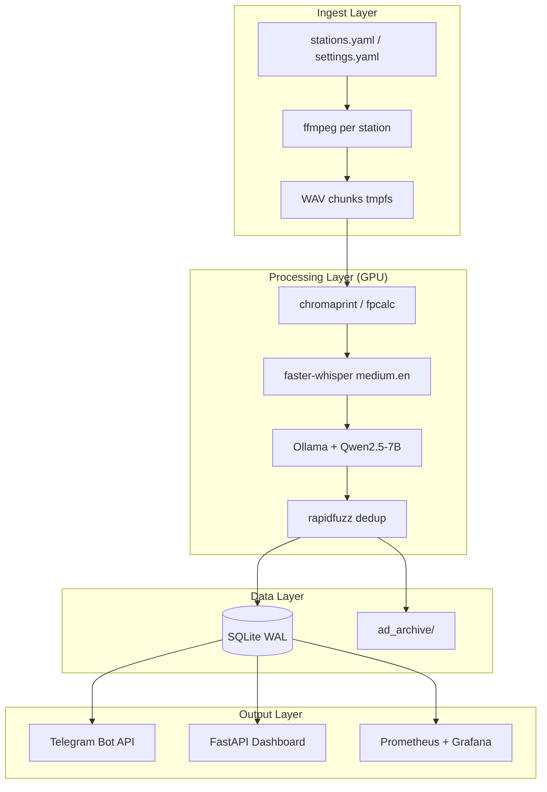

# Tech Stack — Radio Ad-Sensing Pipeline

> เอกสารสรุปเทคโนโลยีที่ใช้ในโปรเจกต์  
> อัปเดต: 2026-06-23 · อ้างอิง: `PLAN.md`, `pyproject.toml`, `docker-compose.yml`

ระบบ pipeline แบบ **fully local** สำหรับ ingest สตรีมวิทยุ News/Talk จากสหรัฐฯ 24/7 ตรวจจับโฆษณาเงินกู้/การเงิน แจ้งเตือนผ่าน Telegram และแสดงผลบน dashboard

---

## Architecture Overview

```
stations.yaml ──> [ingestor]  ffmpeg per station ──> chunks/ (WAV on tmpfs)
                                                        │ (SQLite-backed work queue)
                  [worker]    fingerprint ─> faster-whisper ─> Ollama extract ─> fuzzy dedup ─> detections
                                                        │
                  [alerter]   reads unalerted detections ──> Telegram Bot API
                  [watchdog]  station health, auto-restart, pool promotion
                  [dashboard] FastAPI + HTMX (read-only, SQLite)
                  [prometheus]<── /metrics from all services + dcgm-exporter
                  [grafana]   provisioned dashboards
```



---

## 1. Language & Runtime

| Item | Technology |
|------|------------|
| Primary language | **Python 3.11+** |
| Package manager | **pip** + **Hatchling** (build backend) |
| Install mode | Editable (`pip install -e ".[dev,dashboard,worker]"`) |
| Testing | **pytest 8+** (417 tests) |
| Config loading | **PyYAML**, **pydantic 2.x**, **pydantic-settings** |

---

## 2. Services (Monorepo Microservices)

Packages live under a single repo. `shared/` is import-light (no GPU/ML dependencies).

| Service | Role | Metrics port |
|---------|------|--------------|
| **ingestor** | ffmpeg supervisor, chunk writer, gap logging | 9101 |
| **worker** | ASR → LLM extract → dedup → fingerprint | 9102 |
| **alerter** | Telegram alerts (first-seen, ops, periodic digest) | 9103 |
| **dashboard** | FastAPI UI + REST API | 9104 / **8080** (Win dev: **8081**) |
| **watchdog** | Station health, auto-restart, pool promotion | 9105 |
| **pipeline-migrate** | One-shot SQLite migration init | — |
| **ollama** | Local LLM server | 11434 |
| **ollama-pull** | Init container — pulls model on first start | — |
| **prometheus** | Metrics scrape + alert rule evaluation | 9090 |
| **grafana** | Dashboards (provisioned as code) | 3000 |
| **dcgm-exporter** | NVIDIA GPU metrics (Linux prod) | 9400 |

**Work queue:** SQLite `chunks` table (`pending` / `processing` / `done` / `dropped`). No Redis or Celery.

---

## 3. AI / ML Stack

| Layer | Technology | Details |
|-------|------------|---------|
| **ASR** | [faster-whisper](https://github.com/SYSTRAN/faster-whisper) | Model `medium.en`, compute `float16` (~1.5 GB VRAM) |
| **ASR backend** | CTranslate2 + NVIDIA CUDA | `nvidia-cublas-cu12`, `nvidia-cuda-nvrtc-cu12` |
| **LLM** | [Ollama](https://ollama.com/) | `qwen2.5:7b-instruct-q4_K_M` (~5 GB VRAM) |
| **LLM output** | JSON-schema structured extraction | pydantic validation, retry-on-invalid JSON |
| **Dedup** | [rapidfuzz](https://github.com/maxbachmann/rapidfuzz) | Fuzzy match ≥85% on transcript / company / phone |
| **Audio fingerprint** | Chromaprint via **`fpcalc` CLI** | Offset-tolerant sliding-window match (CPU-only) |
| **Vertical classifier** | Rule-based + taxonomy YAML | `consumer_personal_loan` gating for keyword hits |

**VRAM budget:** ~8 GB total (Whisper + LLM) — designed for a 12 GB GPU (e.g. RTX 3090).

---

## 4. Data Layer

| Item | Technology |
|------|------------|
| Database | **SQLite** (WAL mode, `busy_timeout=5000`, `@retry_on_busy`) |
| Migrations | SQL files in `shared/migrations/` (22 migrations) |
| Chunk storage | WAV on **tmpfs** 4 GB (`/app/chunks`) — transient 24–48 h |
| Ad archive | Permanent audio clips in `data/ad_archive/` |
| Runtime config | `config/stations.yaml`, `config/settings.yaml`, keyword/taxonomy YAML |

**Core tables:** `stations`, `chunks`, `transcripts`, `canonical_ads`, `detections`, `gaps`, `fingerprints`, `keyword_hits`, `status` — plus novelty/review/trademark extensions.

---

## 5. Infrastructure & Deployment

| Item | Technology |
|------|------------|
| Containerization | **Docker Compose** (10 services) |
| Base image | `python:3.11-slim` |
| GPU runtime | **NVIDIA Container Toolkit** |
| Audio processing | **ffmpeg**, **libsndfile1** |
| Volumes | Named volume (`pipeline_data`) in prod; bind mount in dev |
| Compose overrides | `docker-compose.prod.yml`, `docker-compose.windows-dev.yml` |
| Host OS | Ubuntu (prod) / **Windows + Docker Desktop** (dev) |
| Logging | Structured JSON logs; Docker `json-file` driver (10 MB × 3) |
| Healthchecks | Every service has a healthcheck |

### Bring up (Windows GPU dev)

```powershell
docker compose -f docker-compose.yml -f docker-compose.prod.yml -f docker-compose.windows-dev.yml up -d
```

Dashboard: `http://127.0.0.1:8081` · Grafana: `http://127.0.0.1:3000`

---

## 6. Observability

| Layer | Technology |
|-------|------------|
| Metrics library | **prometheus-client** |
| Scrape interval | 15 s — all pipeline services + dcgm + Ollama |
| Dashboards | Grafana provisioned (datasource + 19 panels, `$station` filter) |
| GPU metrics | dcgm-exporter (Linux) / nvidia-smi polling fallback (Windows) |
| Alert rules | `monitoring/alerts.yml` → visible in Grafana |
| Ops alerts | Telegram via alerter service (no Alertmanager in v1) |
| TSDB retention | 15 days |

---

## 7. Dashboard & Frontend

| Item | Technology |
|------|------------|
| Web framework | **FastAPI** + **Uvicorn** |
| Templates | **Jinja2** |
| Interactivity | **HTMX 2.0.4** (CDN) |
| Styling | Inline CSS (dark theme) |
| API modules | Harvest, RadioSense, Hermes, System health, Novelty review |
| CORS | localhost:5173 / 5150 / 4173 (frontend dev) |
| Security | Read-only by default; bound to `127.0.0.1` |

---

## 8. External Integrations

| Service | Usage |
|---------|-------|
| **Telegram Bot API** | Outbound-only (`sendMessage`, `sendAudio`) via **httpx** |
| **Hermes** | Remote ops bridge (`HERMES_BASE_URL`, `local_http` provider) |
| **Radio streams** | HTTP/HTTPS audio (HLS/MP3/AAC) via ffmpeg |

---

## 9. Python Dependencies

From `pyproject.toml`:

```
Core:       pydantic, pydantic-settings, prometheus-client, PyYAML
Worker:     faster-whisper, rapidfuzz
Dashboard:  fastapi, uvicorn, jinja2, python-multipart
Dev:        pytest, httpx, requests
```

System deps (Docker): ffmpeg, curl, ca-certificates, libsndfile1, fpcalc (chromaprint).

---

## 10. Dev Tooling & Agent Ops

| Tool | Type | When |
|------|------|------|
| **Understand-Anything** | Knowledge graph | Architecture Q&A, onboarding |
| **Headroom** | MCP token compressor | Long sessions |
| **Caveman** | Skill pack | Terse output, commit/review |
| **Context7 MCP** | Library docs | faster-whisper, Ollama, FastAPI |
| **Hermes** | Telegram dispatch gate | Pre-merge review |
| **PowerShell scripts** | Ops | `pipeline-status.ps1`, stack start/stop |

See also: `final-install-list.md`, `docs/agent-tooling.md`, `AGENTS.md`.

---

## 11. Explicitly Out of Scope

- PostgreSQL, Redis, Celery, Kafka
- Cloud ML APIs (everything runs on-box)
- Inbound Telegram webhook
- React/Vue SPA (server-rendered + HTMX instead)
- Kubernetes (Docker Compose is sufficient for 4–10 stations)

---

## 12. One-liner Summary

> **Python 3.11 monorepo** → **Docker Compose** + **NVIDIA GPU** → **ffmpeg ingest** → **SQLite queue** → **faster-whisper ASR** → **Ollama/Qwen2.5 extraction** → **rapidfuzz + chromaprint dedup** → **Telegram alerts** + **FastAPI/HTMX dashboard** + **Prometheus/Grafana monitoring**

---

## Related Docs

| Document | Purpose |
|----------|---------|
| [PLAN.md](../PLAN.md) | Architecture, schema, phases, risks |
| [README.md](../README.md) | Setup and quick start |
| [AGENTS.md](../AGENTS.md) | Session memory and operator checklist |
| [OPERATOR_WORKFLOW.md](./OPERATOR_WORKFLOW.md) | Day-to-day ops runbook |
